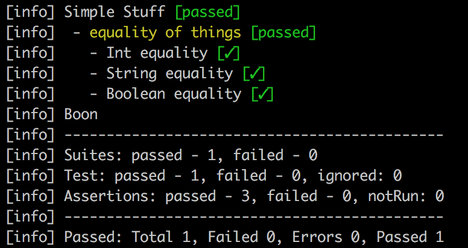
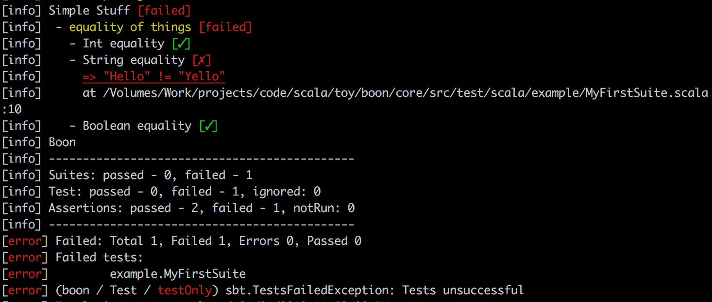

# boon [](https://travis-ci.org/ssanj/boon) [  ](https://bintray.com/ssanj/maven/boon/_latestVersion)

boon is a small framework for testing pure code. boon is:

1. Opinionated
1. Focuses on testing pure code
1. Has no external library dependencies
1. Fast
1. Strongly typed

boon is inspired by [ScalaCheck](https://www.scalacheck.org) - which is a simple but very powerful Property-Based Testing framework.

## Usage in SBT ##

Add the following to your `build.sbt` file:

```scala
libraryDependencies += "net.ssanj" %% "boon" % "0.0.1-b32" % Test

testFrameworks += new TestFramework("boon.sbt.BoonFramework")

resolvers += Resolver.bintrayRepo("ssanj", "maven")
```

You can now run all the usual `sbt` test commands such as: `test` and `testOnly`.

## API ##

At the heart of boon, is a **Predicate**. A predicate is a boolean expression. The most basic way of creating a predicate in boon, is by testing two values for equality:

```scala
actualValue =?= expectedValue
```

_The `=?=` operator is a typesafe equality operator. See [Operators](#operators) for additional operators_.

For example to test two Int operands for equality:

```scala
1 =?= 1
```

A predicate with a description is an **Assertion**:

```scala
actualValue =?= expectedValue | "description"
```

For example:

```scala
1 =?= 1 | "one is one"
```

Assertions are first class constructs in boon and can be combined to give even more Assertions:

```scala
1 =?= 1             | "Int equality"    and
"Hello" =?= "Hello" | "String equality" and
true =?= true       | "Boolean equality"
```

**Assertions** are grouped into a **Test**:

```scala
test("equality of things") {
  1 =?= 1             | "Int equality"    and
  "Hello" =?= "Hello" | "String equality" and
  true =?= true       | "Boolean equality"
}
```

**Tests** are grouped into a **Suite**. All Suites must follow these rules:
- Must be an `object`
- Extend `SuiteLike`
- Override the `tests` method

Here is an outline of a simple **Suite**:

```scala
object MySuite extends SuiteLike("Stuff I want to test") {

  val test1 =

  val test2 =
  ..
  val testn =

  override def tests = oneOrMore(test1, test2 ... testn)
}
```

A more complete example:

```scala
package example

import boon._
import syntax._

object MyFirstSuite extends SuiteLike("Simple Stuff") {

  private val t1 = test("equality of things") {
    1 =?= 1             | "Int equality"    and
    "Hello" =?= "Hello" | "String equality" and
    true =?= true       | "Boolean equality"
  }

  override def tests = one(t1)
}
```

As shown above, to define a Suite, you need the following imports:

```scala
import boon._
import syntax._
```

The `tests` method on `SuiteLike` is defined as:

```
def tests: NonEmptySeq[Test]
```

`NonEmptySeq` is a collection that must have at least one element. It is similar to `NonEmptyList` in [Cats](https://typelevel.org/cats/datatypes/nel.html) and [Scalaz](https://scalaz.github.io/scalaz/scalaz-2.10-7.0.4/doc/index.html#scalaz.NonEmptyList). It can be constructed using the `oneOrMore` function for when you have one or more tests. _When you have a single test you can also use the `one` function for more readability if you prefer_. Requiring a `NonEmptySeq` when defining a Suite means that you can't create a Suite without any tests. This is something that is possible in other testing frameworks and leads to confusion when an empty Suite passes (since it has no tests). boon ensures that invalid states can't be constructed.

Running the above **Suite** produces the following output:



Let's update our String equality predicate so it fails:

```scala
"Hello" =?= "Yello" | "String equality"
```

Now when we run the Suite it produces the following output:




### Operators ###

| Operator  | What it's for | Example |
| ------------- | ------------- | ------------- |
| =?=  | Typesafe predicate for equality  | 1 + 2 =?= 3 |
| =/=  | Typesafe predicate for inequality  | 1 + 2 =/= 4 |
| \\|   | Converts a predicate to an assertion | 1 + 2 =?= 3 \\| "addition" |
| %@  | Multiple assertions on a single value | %@(List(1,2,3)){ l => <br> &nbsp;&nbsp;l.length =?= 5 \\| "length" and <br>&nbsp;&nbsp;l.contains(2) &nbsp;&nbsp;&nbsp;\\| "has 2" <br>} |

### Methods ###

| Method  | What it's for | Example |
| ------------- | ------------- | ------------- |
| and  | Combine Assertions | 1 + 2 =?= 3 \\| "1+2" and <br>4 + 5 =?= 9 \\| "4+5" |
| fail | Fail an assertion | fail("reason") \| "assertion name" |
| pass | Pass an assertion | pass \| "assertion name" |
| test | create a test | <code>test(name) {<br>&nbsp;&nbsp;one or more assertions<br>}</code> |

---

### More Operators ###

| Operator  | What it's for | Example |
| ------------- | ------------- | ------------- |
| \\|   | Also adds a context to an assertion. *The context is displayed when an assertion fails* | x * y =?= 3 \\|("multiplication", "x" -> x.toString, "y" -> y.toString)  |
| >> | Provides custom errors on failure | 1 =?= 2 >> oneOrMore("error1","error2") |


### More Methods ###

| Method  | What it's for | Example |
| ------------- | ------------- | ------------- |
| xtest | ignore a test | <code>xtest(name) {<br>&nbsp;&nbsp;one or more assertions<br>}</code> |

---

### Syntax Extensions ###

#### Exceptions ####

| Operator  | What it's for | Example |
| ------------- | ------------- | ------------- |
| =!=  | Compares an Exception thrown by class and message | <code>flakey =!=[RuntimeException](_ =?= "Boom!" \\| "expected Boom!")</code> |

#### Regular Expressions ####

| Operator  | What it's for | Example |
| ------------- | ------------- | ------------- |
| =^= | Compares a String to a regular expression | "Path error: /some/path" =^= "Path error:.*".r |

#### Option ####

| Operator  | What it's for | Example |
| ------------- | ------------- | ------------- |
| some_? | expects a Some(value) | <code>some_?\[Int\](20.some)(_ =/= 10  \\| "Some(20) is not ten")</code>  |
| none_? | expects a None | <code>none_?\[Int\](noneValue)(pass \\| "expected None")</code> |

#### Either ####

| Operator  | What it's for | Example |
| ------------- | ------------- | ------------- |
| left_? | expects Left value | <code>left_?\[String, Int\](leftValue)(_.endsWith("or1") \\| "ends with or1")</code> |
| right_? | expects a Right value | <code>right_?\[String, Int\](rightValue)(_ =/= 10 \\| "right is not ten")</code> |

#### null ####

| Operator  | What it's for | Example |
| ------------- | ------------- | ------------- |
| null_? | expects a null value | <code>null_?(nullValue)(pass \\| "null value")</code> |
| null_! | expects a non-null value | <code>null_!(notNullString)(_  =?= "notNull" \\| "not null String" )</code> |

---


## Publishing

To publish a new version perform the following tasks:

```
publish
bintrayRelease
```