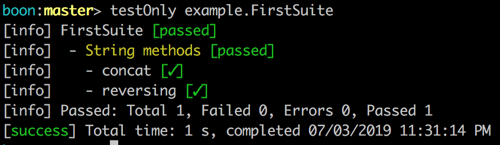
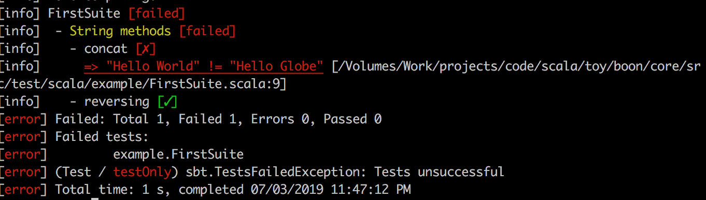

# boon [](https://travis-ci.org/ssanj/boon)

Boon is a simple testing framework for testing pure code. Boon has the following goals:

1. Simple and limited API
1. Focus on testing pure code
1. Fast
1. No external library dependencies
1. Limited test hierarchy

Boon was inspired by most (if not all the other Scala testing frameworks out there) such as [ScalaTest](http://www.scalatest.org/), [Specs2](https://etorreborre.github.io/specs2/), [UTest](https://github.com/lihaoyi/utest) and [MiniTest](https://github.com/monix/minitest). What Boon tries to do differently is to stay out of your way and add a minimal footprint to your test code. To do this it limits its API and what it focusses on. Boon is very particularly for testing pure code.

## Usage in SBT ##

Add the following to your `build.sbt` file:

```scala
libraryDependencies += "net.ssanj" %% "boon" % "0.0.1-b30" % Test

testFrameworks += new TestFramework("boon.sbt.BoonFramework")

resolvers += Resolver.bintrayRepo("ssanj", "maven")
```

You can now run all the usual sbt test commands such as: `test` and `testOnly`.

## API ##

At the heart of Boon, is an **Assertion**. One or more **Assertions** are combined into a **Test** and multiple **Tests** are combined into a **Suite**.

Here is an example of a simple **Suite**:

```scala
package blah

import boon._
import syntax._

object FirstSuite extends SuiteLike("FirstSuite") {

  private val t1 = test("String methods") {
    "Hello" + " " + "World" =?= "Hello World"    | "concat"     and
    "yohoho"                =?= "ohohoy".reverse | "reversing"
  }

  override def tests = NonEmptySeq.nes(t1)
}
```

To use Boon, you need the following imports:

```scala
import boon._
import syntax._
```

All Boon **Suites** must be `object`s and extend the `SuiteLike` class and supply it with a suite name. In the above example the suite name is "FirstSuite". You can call your **Suite** whatever you like.

Tests are defined through the `test` function and require a name, which in the above example is "String Methods" and one or more **Assertions**.

An **Assertion** takes the following format:

```scala
actualValue =?= expectedValue | "assertion name"
```

The `=?=` operator is a typesafe equals operator and the `|` operator simply adds a name to the preceding assertion. All **Assertions** must have names. The `and` operator is used to combine assertions.

Defined tests such as t1 in the above example, must be added a `NonEmptySeq` and used as part of the definition for the `tests` abstract method from the `SuiteLike` trait to be included in the **Suite**.

Running the above **Suite** produces the following output:



We can provoke an assertion failure by changing our *concat* **Assertion**:

```scala
"Hello" + " " + "World" =?= "Hello Globe"    | "concat"
```

which then produces the following output:




### Operators ###

| Operator  | What it's for | Example |
| ------------- | ------------- | ------------- |
| =?=  | Compare two values for equality  | 1 + 2 =?= 3 |
| =/=  | Compare two values for inequality  | 1 + 2 =/= 4 |
| \\|   | Add a label to an assertion | 1 + 2 =?= 3 \\| "addition" |
| \\|#   | Add a label to an assertion and a context. *The context is displayed when an assertion fails* | x * y =?= 3 \\|#("multiplication", "x" -> x.toString, "y" -> y.toString)  |
| =!=  | Compare Exception thrown by class and message | flakey =!=[RuntimeException](_ =?= "Boom!") |
| and  | Combine Assertions | 1 + 2 =?= 3 and 4 + 5 =?= 9 |
| %@  | Create a value for multiple assertions | %@(List(1,2,3)){ l => <br> l.length =?= 5 \\| "length" and l.contains(2) \\| "has 2" } |

### Methods ###

| Method  | What it's for | Example |
| ------------- | ------------- | ------------- |
| fail | Fail an assertion | fail("reason") \| "assertion name" |
| pass | Pass an assertion | passAssertion \| "assertion name" |

## Publishing

To publish a new version perform the following tasks:

```
publish
bintrayRelease
```